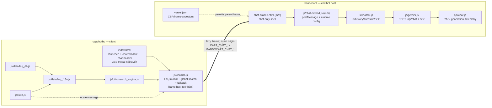

# Phân tích tích hợp iframe `bandocapt` → `capphutho`

**Phạm vi khảo sát:** `D:\04. Github\bandocapt`, `D:\04. Github\capphutho` và `KE_HOACH_THI_CONG_TICH_HOP_CHATBOT_BANDOCAPT_CAPPHUTHO.md`.

**Giới hạn:** đây là báo cáo phân tích; không có mã nguồn hiện hữu nào được sửa. Không khảo sát `node_modules`, `dist`, `coverage`, tài nguyên ảnh lớn, tài liệu/presentation hoặc dữ liệu nghiệp vụ không cần cho điểm ghép.

## Kết luận

Kiến trúc phù hợp là `bandocapt` làm **host chatbot** tại `chat-embed.html`; `capphutho` chỉ giữ launcher, khung modal/header mang nhận diện địa phương và nhúng iframe theo cơ chế lazy-load. Modal FAQ cũ không thể bị xóa nguyên khối: global search cũng đang được điều khiển bởi `js/chatbot.js` và phụ thuộc bộ FAQ cục bộ.

`bandocapt` hiện **không thể nhúng** vì CSP trong `vercel.json` đặt `frame-ancestors 'none'`. Đây là điểm phải đổi bắt buộc trước khi iframe hoạt động.

## Sơ đồ phụ thuộc



## Các file chatbot của `bandocapt` đã xác định

### Runtime hiện tại

| File | Vai trò | Nhận định cho iframe |
|---|---|---|
| `D:\04. Github\bandocapt\index.html` | Trang bản đồ hiện tại; chứa launcher, modal chatbot, Turnstile và mobile navigation. | Không dùng trực tiếp làm iframe vì mang theo bản đồ/navigation/launcher. Là nguồn cấu trúc/ID để tạo shell mới. |
| `D:\04. Github\bandocapt\js\lazy-features.js` | Lazy-load `marked`, `DOMPurify`, `js/gemini.js`, `js/chatbot.js`, Turnstile. | Được `chat-embed.html` tái sử dụng; hiện loader chat không phụ thuộc bản đồ. |
| `D:\04. Github\bandocapt\js\chatbot.js` | UI chat, lịch sử, starter chips, Turnstile, SSE render, feedback; xuất `window.ChatbotUI`. | Phải thêm embed mode/runtime config, `ask`, sự kiện busy/error; giữ stream hiện tại. |
| `D:\04. Github\bandocapt\js\gemini.js` | Ký request, lấy Turnstile token, gửi SSE tới cùng-origin `/api/chat`, gửi feedback. | Phải gắn `clientContext` vào request và đọc metadata route/model/usage. |
| `D:\04. Github\bandocapt\api\chat.js` | Backend RAG/generation/SSE, sanitizer, captcha, cache FAQ, telemetry. | Phase 1 chỉ parse/validate context và telemetry; không chuyển backend sang `capphutho`. |
| `D:\04. Github\bandocapt\api\feedback.js` | Feedback từ chatbot. | Giữ nguyên: iframe vẫn gọi cùng origin `bandocapt`. |
| `D:\04. Github\bandocapt\lib\request-security.js` | Allowlist CORS, HMAC, IP, sanitizer. | Giữ nguyên cho iframe Phase 1; chỉ sửa nếu thay đổi chính sách API cross-origin. Iframe gọi API same-origin nên không cần mở CORS cho `capphutho`. |
| `D:\04. Github\bandocapt\tokens.css`, `output.css`, `styles.css` | Style đang dùng bởi UI chatbot. | `chat-embed.html` nạp lại cùng CSS; thêm stylesheet embed riêng để cô lập layout. |
| `D:\04. Github\bandocapt\vercel.json` | Build/deploy header CSP. | Bắt buộc sửa vì hiện có `frame-ancestors 'none'`. |
| `D:\04. Github\bandocapt\scripts\build-static.js` | Chỉ giữ `index.html` không hash, mọi input khác được hash. | Bắt buộc sửa để giữ `chat-embed.html` là entry cố định và đưa file embed vào `dist`. |
| `D:\04. Github\bandocapt\package.json` | Build, syntax check, unit/E2E scripts. | Sửa để check các JS mới và thêm test embed/router theo kế hoạch. |

### Dữ liệu/logic chatbot liên quan nhưng không đưa sang client

- `D:\04. Github\bandocapt\data\tthc-catalog.json` và các nguồn RAG: chỉ backend/host sử dụng; không sao chép sang `capphutho`.
- `D:\04. Github\bandocapt\js\tthc-catalog.js`: không nạp trong embed Phase 1; catalog compare phải tắt hoặc điều hướng riêng.
- `D:\04. Github\bandocapt\js\app-navigation.js`, `app.js`, `data.js`, `js/location-data.js`: là phụ thuộc bản đồ/navigation của trang chính, không thuộc shell iframe.

## Modal FAQ, global search và dữ liệu FAQ của `capphutho`

| Thành phần | Vị trí | Phụ thuộc/điểm cần giữ |
|---|---|---|
| Launcher + modal | `D:\04. Github\capphutho\index.html` (launcher khoảng dòng 1997; `.chat-window` khoảng dòng 2006) | Giữ `.chat-window`, `.chat-header`, launcher và animation/nhận diện địa phương. Chỉ thay phần body/footer khi bật embed. |
| FAQ modal cũ | `index.html`: `#chatBody`, `#chatOptions`, `#chatSearchInput`, `#chatSendBtn`; `js/chatbot.js` | Controller render menu danh mục, câu hỏi, đáp án và fallback. |
| Global search | `index.html`: `#globalSearchInput`, `#globalSearchResults`, `#globalSearchContainer`; `js/chatbot.js` | Cùng một `ChatbotController`; kết quả gọi `openChatAndSelectCategory/Question`. Không thể xóa controller mà không làm hỏng search. |
| Search engine | `D:\04. Github\capphutho\js\utils\search_engine.js` | Xây index từ `window.MAIN_CATEGORIES` + `window.FAQ_DATA`; normalize không dấu, keyword, cache 100 query. |
| FAQ tiếng Việt | `D:\04. Github\capphutho\js\data\faq_db.js` | Khởi tạo `window.MAIN_CATEGORIES` và `window.FAQ_DATA`; là fallback/local search. |
| FAQ đa ngôn ngữ | `D:\04. Github\capphutho\js\data\faq_i18n.js` | Nạp sau `faq_db.js`; giữ dataset `vi`, `en`, `zh-CN`, rồi thay global FAQ theo ngôn ngữ. |
| i18n trang cha | `D:\04. Github\capphutho\js\i18n.js` | `setLanguage` hiện reload URL; khi tải lại, locale iframe được lấy lại từ parent. File vẫn cần thêm text embed và thông điệp `CAPP_CHAT_SET_LOCALE` cho trường hợp đồng bộ runtime. |
| CSS modal | CSS nội tuyến trong `D:\04. Github\capphutho\index.html` (khoảng dòng 1472–1712) | Không dùng `styles.css` cho modal hiện tại; style shell/iframe phải đặt tại khối CSS nội tuyến này hoặc refactor được phê duyệt riêng. |

## File phải sửa — phạm vi iframe Phase 1

### `bandocapt`

| File | Thay đổi bắt buộc |
|---|---|
| `js/chatbot.js` | Embed mode; ẩn launcher/header/close theo config; expose `ChatbotUI.ask`; phát trạng thái busy/error/ready cho bridge; không đổi core SSE. |
| `js/gemini.js` | Gửi `clientContext` cùng `userMessage`, `history`, `captchaToken`; nhận metadata done nếu API trả về. |
| `api/chat.js` | Parse/allowlist `clientContext` và ghi telemetry Phase 1. Không đưa API key/RAG sang client. |
| `scripts/build-static.js` | Thêm entry/embed assets; thay điều kiện đặc biệt một entry bằng `ENTRY_HTML = new Set(['index.html', 'chat-embed.html'])`. |
| `package.json` | Bổ sung syntax checks/test files embed mới. |
| `vercel.json` | Header `no-cache` cho `/chat-embed.html`; thay CSP cho route embed thành `frame-ancestors 'self' https://capphutho.vercel.app` (thêm localhost/preview chỉ bằng cấu hình môi trường được kiểm soát). Không dùng wildcard. |

### `capphutho`

| File | Thay đổi bắt buộc |
|---|---|
| `index.html` | Giữ header/modal/launcher; thay `.chat-body` + `.chat-footer` bằng `#chatEmbedShell`, loading, iframe có `data-src`, error và nút FAQ fallback; thêm CSS shell/iframe/loading/error tại CSS nội tuyến hiện có; khai báo `CAPP_CHAT_CONFIG` feature flag trước controller. |
| `js/chatbot.js` | Tách nhánh `faq`/`ai-embed`; lazy mount iframe lúc mở lần đầu, handshake/queue/timeout/origin validation/fallback; global search vẫn dùng `FaqSearchEngine`, nhưng click kết quả gửi canonical question/preset ID sang iframe trong embed mode. |
| `js/i18n.js` | Text loading/error/fallback/retry; đồng bộ locale cho iframe khi phù hợp. |

## File tạo mới

### Bắt buộc cho iframe Phase 1

| Dự án | File | Mục đích |
|---|---|---|
| `bandocapt` | `chat-embed.html` | Chat-only document: giữ các ID UI chatbot cần thiết, không có map/launcher/mobile navigation; nạp `tokens.css`, `output.css`, `styles.css`, stylesheet embed, lazy loader và bridge. |
| `bandocapt` | `styles/chat-embed.css` | Full-height, one-scroll-container, không launcher/double border-radius, responsive từ 320px. |
| `bandocapt` | `js/chat-embed.js` | Allowlist query config; bootstrap/lazy load; bridge `postMessage`; READY/BUSY/ERROR; queue câu hỏi tới khi Turnstile sẵn sàng. |
| `bandocapt` | `test/chat-embed-config.test.js` | Test config/query parameter embed. |
| `bandocapt` | `test/e2e/chat-embed.spec.js` | Test URL embed và handshakes thật trong browser. |

### Được kế hoạch yêu cầu cho các phase router/token (không phải điều kiện tối thiểu để iframe hiển thị)

`lib/client-context.js`, `lib/chat-router.js`, `lib/structured-answer.js`, `data/client-profiles.json`, cùng `test/client-context.test.js`, `test/chat-router.test.js`, `test/structured-answer.test.js`, `test/token-budget.test.js` tại `D:\04. Github\bandocapt`.

## File giữ nguyên trong Phase 1

| Dự án | File | Lý do |
|---|---|---|
| `capphutho` | `js/data/faq_db.js` | Fallback FAQ tiếng Việt và nguồn index search. |
| `capphutho` | `js/data/faq_i18n.js` | Dataset EN/ZH và chuyển ngôn ngữ FAQ. |
| `capphutho` | `js/utils/search_engine.js` | Global search đang phụ thuộc trực tiếp. |
| `capphutho` | `styles.css`, `styles/dvc-style.css`, các `modules/*.html` | Không chứa CSS/markup modal đang dùng; ngoài điểm ghép. |
| `bandocapt` | `api/feedback.js`, `lib/request-security.js` | Iframe cùng origin với host; không cần thay CORS/feedback ở Phase 1. |
| `bandocapt` | `js/tthc-catalog.js`, `app.js`, `data.js`, `js/location-data.js`, `js/app-navigation.js` | Bản đồ/catalog/navigation không được đưa vào iframe. |

## Giao thức và ranh giới bảo mật bắt buộc

- Parent chỉ đặt `iframe.src` khi người dùng mở chatbot lần đầu; URL production dự kiến: `https://bandocapt.vercel.app/chat-embed.html?client=capphutho`.
- Parent → iframe: `CAPP_CHAT_INIT`, `CAPP_CHAT_ASK`, `CAPP_CHAT_SET_LOCALE`, `CAPP_CHAT_FOCUS`, `CAPP_CHAT_RESET`.
- Iframe → parent: `BANDOCAPT_CHAT_READY`, `BANDOCAPT_CHAT_CAPTCHA_READY`, `BANDOCAPT_CHAT_BUSY`, `BANDOCAPT_CHAT_ERROR`, `BANDOCAPT_CHAT_CLOSE`, `BANDOCAPT_CHAT_ROUTE`, `BANDOCAPT_CHAT_NAVIGATE`.
- Luôn kiểm tra `event.origin`, so sánh `event.source` với `iframe.contentWindow`, và dùng target origin cụ thể; cấm `postMessage('*')`.
- `clientContext` chỉ là metadata UI/route. Backend allowlist `appId`, `unitId`, `requestedMode`; resolve lại `presetId`/`procedureId`; không tin client cho thẩm quyền, địa chỉ hay nội dung pháp lý.
- CSP là lớp tách biệt với CORS: `frame-ancestors` cho phép `capphutho` nhúng document; API `/api/chat` không cần CORS mới vì request phát từ document có origin `bandocapt`.

## Rủi ro

| Rủi ro | Quan sát hiện trạng | Giảm thiểu |
|---|---|---|
| CSP chặn iframe | `vercel.json` đang có `frame-ancestors 'none'`. | Rule riêng/hẹp cho embed, test production + preview trước rollout. |
| Turnstile trong iframe | Chat hiện yêu cầu token trước khi bật input. | Test iframe cross-origin/nested behavior; READY khác CAPTCHA_READY; queue câu hỏi và fallback FAQ. |
| Hỏng global search | Global search nằm trong chính `ChatbotController` FAQ. | Không xóa `faq_db.js`, `faq_i18n.js`, `search_engine.js` hoặc controller cũ; chỉ branch theo feature flag. |
| Double header/double scroll | `bandocapt/index.html` chứa header/modal riêng, còn parent cũng giữ header. | Shell embed không mang launcher/header nội bộ; CSS 100% height và một scroll region. |
| Cache asset sau deploy | `vercel.json` cache JS/CSS immutable; build hash asset. | `chat-embed.html` no-cache, build script thêm entry và rewrite hashed references. |
| Mở quá rộng trust boundary | `postMessage`, CSP và `clientContext` là dữ liệu cross-origin. | Origin/source validation, allowlist hẹp, không truyền secret/token Firebase/API key. |
| Fallback FAQ cũ lỗi thời | FAQ local chỉ là dữ liệu hiện có, chưa được duyệt để nhập RAG. | Chỉ dùng fallback; không import tự động sang kho chính thức. |
| Dirty worktree ở `bandocapt` | Có thay đổi sẵn tại `api/chat.js`, test, docs và presentation. | Không chồng/sửa các thay đổi đó khi triển khai; tách commit tích hợp. |

## Lệnh kiểm thử hiện có

### `bandocapt`

```powershell
Set-Location 'D:\04. Github\bandocapt'
npm test
npm run check:syntax
npm run build
npm run test:e2e
npm run test:regression:tam-tru
npm run ci
```

- `npm test`: `node --test test/*.test.js`.
- `npm run build`: build Tailwind, kiểm tra cú pháp, build static `dist`.
- `npm run test:e2e`: build rồi `playwright test`.
- `npm run test:regression:tam-tru`: regression tập câu cư trú đã định danh.
- Sau khi thêm embed, cần bổ sung chạy trực tiếp `node --test test/chat-embed-config.test.js` và Playwright spec embed; các file này chưa tồn tại.

### `capphutho`

```powershell
Set-Location 'D:\04. Github\capphutho'
npm test
python tests/verify_security.py
```

- `npm test` hiện chỉ là placeholder và chủ động trả lỗi `Error: no test specified`.
- `tests/verify_security.py` tồn tại nhưng không được khai báo trong npm scripts.
- Cần bổ sung kiểm thử browser/integration trong lượt triển khai sau, không chạy ở lượt phân tích này.

## Trạng thái lượt này

- Đã tạo đúng một artefact theo yêu cầu: file báo cáo này.
- Không sửa mã nguồn chatbot, FAQ, backend, CSP, build hay test.
